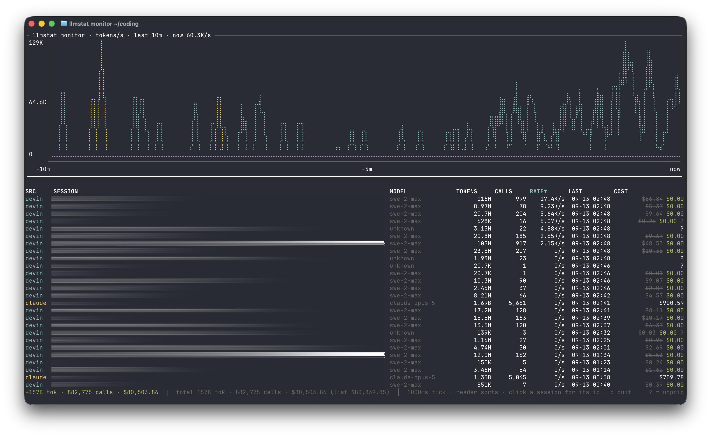

# llmstat

[](https://crates.io/crates/llmstat)
[](https://github.com/lexoliu/llmstat/releases/latest)
[](LICENSE)

Token usage and cost reports for local LLM CLIs: Devin CLI, Claude Code, and
Codex CLI. Prices come from the LiteLLM pricebook. Pure Rust.



- Per-model totals: input / cache-read / output tokens, calls, share, cost
- Free CLI models are still priced at a public equivalent (SWE-2 → kimi-k3):
  the list price is struck through and the actual $0.00 is shown in green
- `monitor` is a live TUI: rolling tokens/s chart plus a per-session table;
  click a column header to sort, click a session name to reveal its id
- Each report estimates the energy behind the tokens (kWh and cost at the
  US industrial electricity rate)
- All sources are cached incrementally; repeat runs only parse appended data

Reports print to stdout and exit. Colors are used only on a TTY and respect
`NO_COLOR`.

## Install

Prebuilt binaries are attached to every GitHub Release — no Rust toolchain
needed.

macOS / Linux:

```sh
curl --proto '=https' --tlsv1.2 -LsSf https://github.com/lexoliu/llmstat/releases/latest/download/llmstat-installer.sh | sh
```

Windows (PowerShell):

```powershell
powershell -c "irm https://github.com/lexoliu/llmstat/releases/latest/download/llmstat-installer.ps1 | iex"
```

Or download a platform archive from
[Releases](https://github.com/lexoliu/llmstat/releases/latest)
(`aarch64`/`x86_64` macOS, `aarch64`/`x86_64` Linux gnu + musl,
`x86_64` Windows). Each archive ships with a `.sha256`.

From source via crates.io:

```sh
cargo install llmstat
```

## Usage

```
llmstat                 # all recorded history (default: `all`)
llmstat daily           # last 24 hours, hourly timeline  (alias: 24h)
llmstat weekly          # last 7 days, daily timeline
llmstat monthly         # last 30 days, daily timeline
llmstat monitor         # real-time monitor: rolling tok/s chart + per-session table
llmstat speedtest devin --model swe-2 --effort max --runs 3
llmstat speedtest antigravity --model gemini-3.8-flash --effort low
llmstat speedtest devin --list   # live model catalog
```

`monitor` polls the append-only logs (default 1s, `--interval-ms` floor 200ms)
and shows tokens/s per source over the last 10 minutes plus a per-session
table. Sessions display a human-readable name (task title, slug, or first
prompt); clicking the SESSION cell toggles that row to its canonical id.
Clicking a column header sorts the table — default is rate descending, then
last activity. Tokens appear when an API call completes, which is when the
CLIs write usage to disk. Quit with `q`, `Esc`, or `Ctrl-C`.

`speedtest` fires live inference calls and reports TTFT, decode tok/s, and
token usage per run. `--model` and `--effort` are both required and resolved
against the provider's live catalog (`<model>-<effort>` → uid), so an
expensive tier can never be probed by accident. Providers: `devin` (the CLI's
own Connect-RPC backend, any model your plan exposes) and `antigravity`
(Google Cloud Code Assist, using the local `antigravity-cli` or CLIProxyAPI
credentials).

```
llmstat --sources devin,claude      # read only these sources
llmstat -f 'source:claude and not free'   # keep only matching calls
llmstat weekly -f 'model~opus'      # works on reports and `monitor`
llmstat --devin-transcripts DIR     # override ~/.local/share/devin/cli/transcripts
llmstat --devin-db FILE             # override the sessions.db path
llmstat --devin-transcripts-only    # skip sessions.db (transcripts only)
llmstat --claude-dir DIR            # override ~/.claude/projects
llmstat --codex-dir DIR             # override ~/.codex
llmstat --pricing rules.toml        # extra pricing rules (see below)
llmstat --refresh-prices            # re-fetch the LiteLLM pricebook
```

Without `--sources`, every source whose data directory exists is read; the
three scans run concurrently.

## Filters

`--filter`/`-f` keeps only matching calls — reports, timeline, costs, and
energy all reflect the subset. Repeatable; multiple filters are ANDed. A
bare word means `model~word`.

```sh
llmstat -f 'opus'                          # model contains "opus"
llmstat -f 'source:claude and model~opus'
llmstat -f 'not free'                      # only paid models
llmstat -f 'tokens>100k or cost>0.5'
llmstat weekly -f 'date>=2026-09-01' -f 'family:swe-2'
```

| field | matches | ops |
|---|---|---|
| `model` | raw model name | `=` `!=` `~` `:` `!~` `!:` |
| `family` | resolved pricing label | same |
| `source` | `devin`/`claude`/`codex` | same |
| `session` | session id or title | same |
| `tokens` `input` `cached` `output` | per-call counts (`1k`/`2m`/`3b`) | `< <= = != >= >` |
| `cost` | per-call list-price USD | same |
| `date` | `YYYY-MM-DD`, `YYYY-MM-DDTHH:MM`, RFC3339, `today`, `yesterday`, `12h`/`7d`/`2w` | same |
| `estimated` `free` `paid` `unpriced` | flags | bare, or `= true/false` |

`=`/`!=` are exact after normalization (lowercase, non-alnum → `-`), so
`model=swe-2-max` matches `SWE-2 Max`; `~`/`:` are substring. Combine with
`and`/`or`/`not` (also `&&`/`||`/`!`) and parens; adjacent predicates AND.
Day-grained dates span the whole local day: `date=2026-09-11` matches that
day, `date>2026-09-11` starts the day after.

## Sample output (daily)

```
llmstat · last 24h · Sep 11 19:18 → Sep 12 19:18
3182 sessions · 15,602 calls · 1.58B tokens
devin: 81 transcripts · +23469 calls (2.82B tok) recovered from sessions.db
claude: 4776 transcript files · 121842 dupes skipped
codex: 2178 rollout files
prices: litellm (cache)
input 114M · cached 1.47B · output 5.52M
list (equiv.) $928.61   actual $185.09   · some models unpriced

── by model ─────────────────────────────────────────
 SRC    MODEL           TOTAL  SHARE       IN   CACHED      OUT  PRICED AS      LIST   ACTUAL  DIST
 devin  SWE-2           1.22B  76.8%     110M    1.10B    4.68M  kimi-k3 *    $730.27    $0.00  ██████████████
 claude claude-opus-5    317M  20.0%    2.42M     314M     636K  claude-opus-5 $185.09  $185.09  ████
 ...
```

- `list` is what the usage would cost at public list price; `actual` is what
  the CLI charges — $0.00 in green for models the CLI offers free
- `*` marks free-in-CLI models; `?` means no price was found

## Pricing

Base prices come from LiteLLM's
[`model_prices_and_context_window.json`](https://github.com/BerriAI/litellm),
fetched once and cached for 24h in `~/.cache/llmstat/` (a stale cache is used
offline). Model names are normalized and matched by exact key, then by `-`
-delimited prefix.

Built-in rules price free-in-CLI models at an equivalent public model:

| Model | Priced as | Status |
|---|---|---|
| SWE-1.7 | `kimi-k2.7-code` ($0.95/$0.19/$4.00 per 1M) | free in Devin → $0.00 |
| SWE-2 | `kimi-k3` ($3.00/$0.30/$15.00) | free in Devin → $0.00 |
| Adaptive | `kimi-k3` (est.) | free in Devin → $0.00 |
| GLM-5 | `glm-5` | free in Devin → $0.00 |

A rule may carry `as` = a LiteLLM key, so the equivalent model's *current*
price is borrowed from the pricebook and the rule's own numbers only apply
when the key isn't listed.

Custom rules — `~/.config/llmstat.toml` or `--pricing file.toml`:

```toml
# substring match on the normalized model name (lowercase, non-alnum → '-')
[[rule]]
pattern = "swe-2"
label = "SWE-2"
free = true            # list price struck through, actual $0.00
as = "kimi-k3"         # borrow LiteLLM's current price for this key

[[rule]]
pattern = "my-proxy-model"
input = 2.0            # USD per 1M input tokens
cached = 0.2           # optional, defaults to input
output = 8.0           # USD per 1M output tokens
```

User rules take precedence over built-ins and LiteLLM.

## Energy ("did you know")

Every report footer estimates the serving energy behind the tokens, shows
2–3 everyday equivalences, and prices the electricity at the US industrial
rate ($0.081/kWh, EIA). This is an order-of-magnitude estimate — real serving
energy swings several-fold with batch utilization.

Per-model J/token, two paths:

1. **Known architectures** — `J/token = P_active[B] / 100`
   (`2 × active params` FLOPs/token ÷ ~200 GFLOP/J datacenter-effective:
   H100 BF16, ~30% MFU, node overhead, PUE 1.15). Parameters come from the
   upstream model card; post-trained models inherit their base (SWE-2 →
   Kimi K3 = 104B activated). The pricing `as` alias chain is followed.
2. **Unknown-parameter models** — list-price inversion. Energy is ~3–5%
   of serving cost, so price implies GPU-slot-seconds/token, which
   converts to energy directly: `J/token = price_$/Mtok × 3 × (1 − margin)`
   with `margin = 0.5` assumed. Input and output are inverted separately.

Cache-read tokens are counted at zero (their prefill was already billed
as input when it ran).

```toml
[energy]
margin = 0.5            # gross margin assumed in price inversion

[[param]]
pattern = "my-model"    # normalized substring, like [[rule]]
active_b = 32.0         # activated parameters in billions
```

## Notes

- Recovered Devin calls show exact input tokens; the cached/output split is
  estimated and marked in the output.
- Models with no matching price are shown as `?` and excluded from totals.
- Devin's db scan assumes `message_nodes` is append-only (`row_id`
  AUTOINCREMENT); a rebuilt database invalidates the cache automatically.
